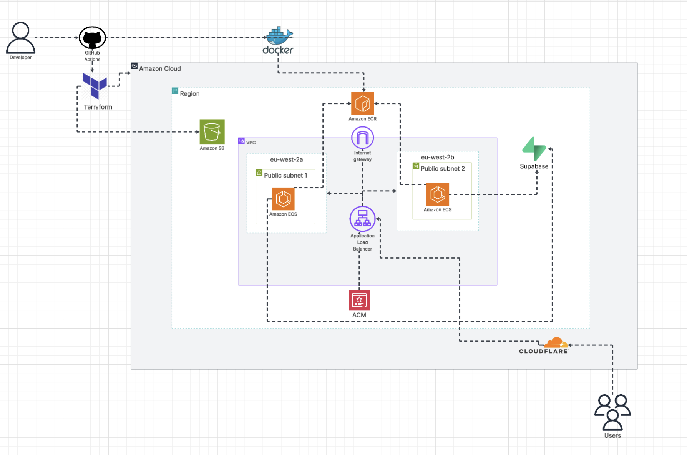

# Mindful Motion - Complete DevOps Infrastructure Project

## 🚀 Project Overview

**Mindful Motion** is a comprehensive DevOps infrastructure project that demonstrates modern cloud architecture, CI/CD practices, and infrastructure automation. This project showcases a production-ready Next.js application deployed on AWS with automated deployment pipelines.

## ✨ Application Features

### Core Application
- **Next.js 15** application with modern React patterns
- **Emotion Analysis** using TensorFlow.js and Face API
- **Daily Check-in System** for mental health tracking
- **Responsive Design** optimized for mobile and desktop
- **Real-time Updates** with modern web technologies

### Technical Stack
- **Frontend:** Next.js 15, React, TypeScript
- **AI/ML:** TensorFlow.js, Face API for emotion detection
- **Backend:** Supabase for authentication and database
- **Styling:** Modern CSS with responsive design
- **State Management:** React hooks and context

## 🏗️ Infrastructure Overview

### Cloud Platform
- **AWS** as the primary cloud provider
- **Multi-AZ deployment** for high availability
- **Production-ready** architecture with security best practices

### Core Services
- **VPC** with public subnets across availability zones
- **Application Load Balancer** with HTTPS support
- **ECS Fargate** for serverless container orchestration
- **CloudWatch** for logging and monitoring
- **ACM** for SSL/TLS certificate management

### Security Features
- **Security Groups** with least privilege access
- **IAM Roles** following AWS best practices
- **VPC isolation** with proper network segmentation
- **HTTPS enforcement** with automatic redirects

## 🏛️ Architecture Diagram



### Architecture Components
1. **CI/CD Pipeline:** GitHub Actions → Terraform → AWS
2. **Container Registry:** Docker → Amazon ECR
3. **Load Balancing:** Application Load Balancer with health checks
4. **Container Orchestration:** ECS Fargate across multiple AZs
5. **External Services:** Supabase backend, Cloudflare CDN
6. **Monitoring:** CloudWatch logs and metrics

### Data Flow
- **Users** → Cloudflare → ALB → ECS → Application
- **Application** → Supabase for backend services
- **CI/CD** → Terraform → AWS infrastructure provisioning

## 🔄 CI/CD Pipelines

### GitHub Actions Workflows

#### 1. CI Pipeline (`ci.yml`)
- **Trigger:** Push to main branch
- **Actions:**
  - Build and optimize Docker image
  - Push to Amazon ECR
  - Run Trivy vulnerability scanning
  - Multi-stage builds for security

#### 2. Infrastructure Pipeline (`deploy.yml`)
- **Trigger:** Manual workflow dispatch
- **Actions:**
  - Terraform validation and linting
  - Infrastructure deployment/destruction
  - Manual confirmation required for destructive actions
  - Proper timeouts and error handling

### Pipeline Features
- **Matrix builds** for parallel validation
- **Manual confirmations** for safety
- **Timeout limits** to prevent hanging workflows
- **Environment protection** for production

## 🐳 Docker Implementation

### Multi-Stage Build Strategy
```dockerfile
# Build Stage
FROM node:20-alpine AS builder
# Build optimization and dependency installation

# Production Stage  
FROM node:20-alpine AS production
# Minimal runtime with non-root user
```

### Best Practices Implemented

#### 1. Image Size Optimization
- **Next.js standalone output** eliminates `node_modules`
- **Multi-stage builds** separate build and runtime
- **Alpine Linux base** for minimal footprint
- **Layer caching** optimization for faster builds

#### 2. Security Enhancements
- **Non-root user** (`appuser`) for container security
- **Build arguments** for secure credential passing
- **Minimal runtime dependencies** only
- **Health checks** for container monitoring

#### 3. Build Efficiency
- **Dependency layer caching** for faster rebuilds
- **Context optimization** with `.dockerignore`
- **Parallel build processes** where possible
- **Optimized package installation**

### Image Size Results
- **Before optimization:** 1.34GB
- **After optimization:** 290MB
- **Size reduction:** **78% improvement** (from 1.34GB to 290MB)

#### Visual Proof of Optimization
**Before Optimization (1.34GB):**


**After Optimization (290MB):**


## 🛠️ Local Setup

### Prerequisites
- **AWS CLI** configured with appropriate credentials
- **Terraform** 1.12.2 or higher
- **Docker** and **Docker Compose** for local container testing
- **Node.js** 18+ for local development

### Quick Start

#### 1. Clone and Setup
```bash
git clone (repo url)
cd mindful-Motion-final
```

#### 2. Configure Terraform Variables
```bash
cd terraform
cp terraform.tfvars.example terraform.tfvars
# Edit terraform.tfvars with your values
```

#### 3. Initialize Terraform
```bash
terraform init
terraform plan
```

#### 4. Local Docker Testing
```bash
cd ..
docker-compose up --build
# Or for detached mode:
# docker-compose up -d --build
```

### Required Configuration

#### AWS Credentials
```bash
aws configure
# Enter your AWS Access Key ID, Secret Access Key, and Region
```

#### Environment Variables
Create a `.env.local` file:
```env
NEXT_PUBLIC_SUPABASE_URL=your_supabase_url
NEXT_PUBLIC_SUPABASE_ANON_KEY=your_supabase_key
```

#### Terraform Variables
Update `terraform.tfvars` with your values:
- **AWS Region** (e.g., `eu-west-2`)
- **Domain name** (if using custom domain)
- **VPC CIDR blocks** (if customizing network)

## 🔐 Security Considerations

### Secrets Management
- **GitHub Secrets** for sensitive configuration
- **No hardcoded credentials** in code
- **Environment-specific** configuration
- **Proper IAM roles** with least privilege

### Network Security
- **VPC isolation** with security groups
- **HTTPS enforcement** with ACM certificates
- **Public subnets** with controlled access
- **Security group rules** for specific ports only

### Container Security
- **Non-root users** in containers
- **Vulnerability scanning** with Trivy
- **Minimal attack surface** with optimized images
- **Regular security updates** through CI/CD

## 📊 Monitoring and Observability

### CloudWatch Integration
- **ECS service logs** with structured logging
- **Load balancer access logs** for traffic analysis
- **Custom metrics** for application performance
- **Log retention** policies for compliance

### Health Checks
- **ALB health checks** for service availability
- **Container health checks** for application status
- **Automatic failover** across availability zones
- **Real-time monitoring** of infrastructure health

## 📞 Support

For questions or issues:
- **Create an issue** in the GitHub repository
- **Consult architecture** diagram for understanding

